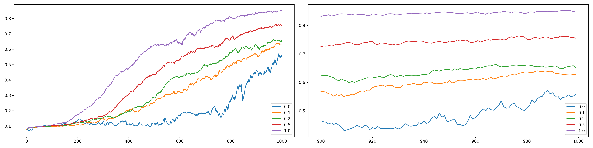

# Result in Mnist

The number of rounds of communication necessary to achieve a test-set accuracy of 95%, and our max round is 1000:

|           | E=1, B=16 | E=1, B=1024 | E=5, B=16 | E=1, B=1024 |
| :-------: | :-------: | :---------: | :-------: | :---------: |
| **C=0.0** |    901    |      -      |    754    |      -      |
| **C=0.1** |    871    |      -      |    322    |      -      |
| **C=0.2** |    802    |      -      |    245    |      -      |
| **C=0.5** |    660    |      -      |    188    |      -      |
| **C=1.0** |    530    |      -      |    150    |      -      |

- E=1, B=16
  
  
  
- E=1, B=1024

  

- E=5, B=16

  

- E=5, B=1024

  

  
